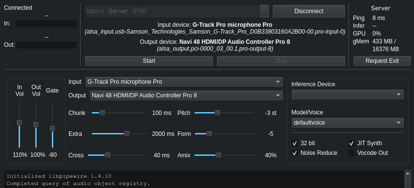

# uwavclient
This is a voice changer client, programmed in C++/Qt so that it's fast and doesn't need to load an entire ass web browser in the background just to access your microphone. It is *only* a client, as the intended use case is to offload the actual voice conversion to a different computer over a local network.

This software is meant to connect to a [uwarevoice](https://github.com/Uwaan/uwarevoice) server, since that is the voice conversion server that I am working on, but it will theoretically work with any server that implements [PROTOCOL.md](docs/PROTOCOL.md) for client/server communication.



This is all a work in progress and kind of experimental. Local audio capture/playback is done by directly accessing pipewire to minimize latency, so in other words this is a Linux application which only works on Linux and there is *no windows build* and *it doesn't support windows* and *you won't find a windows download*. It also doesn't support MacOS, so in hindsight, I'm sorry. I probably should have used PortAudio or some other cross-platform library. It wouldn't be too hard to redo the AudioProvider class for other platforms, but I don't have any plans to do so at this time.

I programmed this all by myself, no vibe coding whatsoever (although I did have to ask Claude a few questions). It was a lot of work, and I'm very proud of myself for making something that works in the first place, so please be nice to me if you decide to leave a comment.

## Installation Instructions
Dependencies: pipewire, Qt 5 or higher
Also requires: [uwarevoice](https://github.com/Uwaan/uwarevoice) server to connect to, which can run on this computer or a remote computer.

```
> git clone https://github.com/Uwaan/uwavclient
> cd uwavclient
> ./uwavclient
```

## Troubleshooting

### Verify that your system is using pipewire for audio
`$ pw-cli --version`

Note: If pipewire is not ***already installed***, this software will not work for you at this time. Do not attempt to install pipewire using your distribution's package manager. Do not attempt to install pipewire manually. There are ways to switch your desktop over to pipewire instead of alsa/pulseaudio/whatever, but those ways are *complicated* and will *probably almost definitely mess things up* and it involves things that are way outside the scope of this little piece of software.

### Check whether Qt is available
`$ ls /usr/bin/qmake*`

KDE/Plasma relies on Qt by default, and if you've installed much other desktop/GUI software, chances are you already have this as well, but it can't hurt to check:

If it is not already on your system, this can be safely installed using your distribution's package manager. It only needs the 'base' or 'core' packages, you don't need any of the development stuff or modules.

## Not Yet Implemented

- Compute device selection - this is next on my todo list for the server, and will be implemented in this client once it's done over there
- Model selection - same, this is hard-coded on the server side for now, and switching needs to be implemented over there first

